# 🗄️ MCP Database Toolbox

<p align="center">
  
</p>

<p align="center">
  <strong>Universal Database Connectivity for AI Agents</strong>
</p>

<p align="center">
  [Quick Start](#-quick-start) •
  [Databases](#-supported-databases) •
  [Documentation](#-documentation) •
  [Contributing](CONTRIBUTING.md) •
  [Community](#-community)
</p>

<p align="center">

  [](https://opensource.org/licenses/MIT)
  [](https://github.com/cognition-ai/database-toolbox/actions)
  [](https://hub.docker.com/u/e0h8a4b6)

</p>

---

## 📖 Overview

**MCP Database Toolbox** provides production-ready Docker images that enable AI agents and applications to connect to 20+ database systems through the [Model Context Protocol (MCP)](https://modelcontextprotocol.io/). Built on Google's Database Toolbox, these images offer a unified interface for database operations across SQL, NoSQL, graph, and analytics platforms.

### Why MCP Database Toolbox?

- **🚀 Zero Configuration** - Pre-built Docker images ready to use
- **🔗 Universal Interface** - Consistent API across all database types  
- **🔐 Enterprise Security** - Environment-based credential management
- **📊 Extensive Coverage** - 20+ database systems from SQL to NoSQL to analytics
- **🐳 Cloud Native** - Optimized for containerized and serverless environments
- **⚡ Production Ready** - Battle-tested with SBOM, provenance attestation, and multi-arch support

---

## 🚀 Quick Start

Get started in under 60 seconds with PostgreSQL:

```bash
# Pull the base toolbox image
docker pull us-central1-docker.pkg.dev/database-toolbox/toolbox/toolbox:latest

# Run with your PostgreSQL credentials
POSTGRES_HOST=localhost \
POSTGRES_DATABASE=mydb \
POSTGRES_USER=postgres \
POSTGRES_PASSWORD=secret \
docker run --rm -i \
  -e POSTGRES_HOST \
  -e POSTGRES_DATABASE \
  -e POSTGRES_USER \
  -e POSTGRES_PASSWORD \
  us-central1-docker.pkg.dev/database-toolbox/toolbox/toolbox:latest \
  --prebuilt postgres \
  --stdio
```

> 💡 **Tip**: See the [full configuration guide](#-database-configurations) for your database below.

---

## 🏗️ Architecture

### How It Works

```mermaid
graph TD
    A["🤖 AI Agent<br/>(Claude, GPT, etc.)"] -->|MCP Protocol<br/>stdio| B["🐳 Docker Image<br/>MCP Toolbox"]
    B -->|Database Driver| C["🗄️ Database<br/>(Any supported)"]
    
    style A fill:#a6da95,stroke:#363a4f,stroke-width:2px,color:#24273a
    style B fill:#8aadf4,stroke:#363a4f,stroke-width:2px,color:#24273a
    style C fill:#f5a97f,stroke:#363a4f,stroke-width:2px,color:#24273a
```



### 🐳 About These Images

All database images use the official Google Database Toolbox as the base:

```bash
us-central1-docker.pkg.dev/database-toolbox/toolbox/toolbox:latest
```

Each database configuration runs this image with either:

- 🔧 **`--prebuilt` flag** - For databases with built-in support (most common)
- 📝 **`--tools-file` flag** - For databases requiring custom configuration YAML files
- 📡 **`--stdio` flag** - Required for MCP protocol communication

### Prebuilt vs Custom Configuration

| **Prebuilt Support** ✅ | **Custom Config Required** 📝 |
|-------------------------|-------------------------------|
| AlloyDB for PostgreSQL  | Bigtable                      |
| BigQuery                | Couchbase                     |
| Cloud SQL (MySQL)       | Dgraph                        |
| Cloud SQL (PostgreSQL)  | MongoDB                       |
| Cloud SQL (SQL Server)  | Neo4j                         |
| Dataplex                | Redis                         |
| Firestore               | Redshift                      |
| Looker                  | SQLite                        |
| MySQL                   | TiDB                          |
| PostgreSQL              | Valkey                        |
| Spanner                 |                               |
| SQL Server              |                               |

---

## 📋 Table of Contents

- [Supported Databases](#-supported-databases)
  - [SQL Databases](#sql-databases)
  - [NoSQL Databases](#nosql-databases)
  - [Analytics & Data Warehouses](#analytics--data-warehouses)
  - [Graph Databases](#graph-databases)
  - [Cache & In-Memory](#cache--in-memory)
- [Database Configurations](#️-database-configurations)
- [Troubleshooting](#-troubleshooting)
- [FAQ](#-faq)
- [Contributing](#-contributing)
- [Community](#-community)
- [License](#-license)

---

## 📋 Supported Databases

### SQL Databases

| Database | Description | Prebuilt | Provider |
|----------|-------------|----------|----------|
| [AlloyDB for PostgreSQL](#alloydb-for-postgresql) | Fully-managed PostgreSQL-compatible database | ✅ | Google Cloud |
| [Cloud SQL for MySQL](#cloud-sql-for-mysql) | Fully-managed MySQL database service | ✅ | Google Cloud |
| [Cloud SQL for PostgreSQL](#cloud-sql-for-postgresql) | Fully-managed PostgreSQL database service | ✅ | Google Cloud |
| [Cloud SQL for SQL Server](#cloud-sql-for-sql-server) | Fully-managed SQL Server database service | ✅ | Google Cloud |
| [MySQL](#mysql) | Open-source relational database | ✅ | Community |
| [PostgreSQL](#postgresql) | Open-source object-relational database | ✅ | Community |
| [Spanner](#spanner) | Globally distributed relational database | ✅ | Google Cloud |
| [SQL Server](#sql-server) | Microsoft relational database | ✅ | Microsoft |
| [SQLite](#sqlite) | Lightweight file-based database | 📝 | Community |
| [TiDB](#tidb) | Distributed SQL database | 📝 | PingCAP |

### NoSQL Databases

| Database | Description | Prebuilt | Type |
|----------|-------------|----------|------|
| [Bigtable](#bigtable) | Low-latency wide-column store | 📝 | Wide-Column |
| [Couchbase](#couchbase) | Distributed document database | 📝 | Document |
| [Firestore](#firestore) | Serverless document database | ✅ | Document |
| [MongoDB](#mongodb) | Document-oriented database | 📝 | Document |

### Analytics & Data Warehouses

| Database | Description | Prebuilt | Provider |
|----------|-------------|----------|----------|
| [BigQuery](#bigquery) | Petabyte-scale analytics data warehouse | ✅ | Google Cloud |
| [Dataplex](#dataplex) | Unified data governance solution | ✅ | Google Cloud |
| [Looker](#looker) | Business intelligence platform | ✅ | Google Cloud |
| [Redshift](#redshift) | Amazon's data warehouse service | 📝 | AWS |

### Graph Databases

| Database | Description | Prebuilt | Type |
|----------|-------------|----------|------|
| [Dgraph](#dgraph) | Distributed graph database | 📝 | Native Graph |
| [Neo4j](#neo4j) | Graph database management system | 📝 | Native Graph |

### Cache & In-Memory

| Database | Description | Prebuilt | Type |
|----------|-------------|----------|------|
| [Redis](#redis) | In-memory data structure store | 📝 | Key-Value |
| [Valkey](#valkey) | Open-source Redis fork | 📝 | Key-Value |

> **Legend**: ✅ = Prebuilt configuration available | 📝 = Custom YAML configuration required

## 🗄️ Database Configurations

---

## AlloyDB for PostgreSQL

AlloyDB for PostgreSQL is a fully-managed, PostgreSQL-compatible database for demanding transactional workloads.

### Docker Command

```bash
ALLOYDB_POSTGRES_PROJECT=my-project \
ALLOYDB_POSTGRES_REGION=us-central1 \
ALLOYDB_POSTGRES_CLUSTER=my-cluster \
ALLOYDB_POSTGRES_INSTANCE=my-instance \
ALLOYDB_POSTGRES_DATABASE=mydb \
ALLOYDB_POSTGRES_USER=postgres \
ALLOYDB_POSTGRES_PASSWORD=your-password \
GOOGLE_APPLICATION_CREDENTIALS=/creds/sa.json \
docker run --rm -i \
  --name mcp-alloydb \
  -e ALLOYDB_POSTGRES_PROJECT \
  -e ALLOYDB_POSTGRES_REGION \
  -e ALLOYDB_POSTGRES_CLUSTER \
  -e ALLOYDB_POSTGRES_INSTANCE \
  -e ALLOYDB_POSTGRES_DATABASE \
  -e ALLOYDB_POSTGRES_USER \
  -e ALLOYDB_POSTGRES_PASSWORD \
  -e GOOGLE_APPLICATION_CREDENTIALS \
  -v /path/to/service-account.json:/creds/sa.json \
  us-central1-docker.pkg.dev/database-toolbox/toolbox/toolbox:latest \
  --prebuilt alloydb-postgres \
  --stdio
```

### MCP Client Configuration

```json
"alloydb": {
  "command": "docker",
  "args": [
    "run", "--rm", "-i",
    "-v", "${GOOGLE_APPLICATION_CREDENTIALS_PATH}:/creds/sa.json",
    "-e", "GOOGLE_APPLICATION_CREDENTIALS=/creds/sa.json",
    "-e", "ALLOYDB_POSTGRES_PROJECT",
    "-e", "ALLOYDB_POSTGRES_REGION", 
    "-e", "ALLOYDB_POSTGRES_CLUSTER",
    "-e", "ALLOYDB_POSTGRES_INSTANCE",
    "-e", "ALLOYDB_POSTGRES_DATABASE",
    "-e", "ALLOYDB_POSTGRES_USER",
    "-e", "ALLOYDB_POSTGRES_PASSWORD",
    "us-central1-docker.pkg.dev/database-toolbox/toolbox/toolbox:latest",
    "--prebuilt", "alloydb-postgres",
    "--stdio"
  ],
  "env": {
    "ALLOYDB_POSTGRES_PROJECT": "my-project",
    "ALLOYDB_POSTGRES_REGION": "us-central1",
    "ALLOYDB_POSTGRES_CLUSTER": "my-cluster",
    "ALLOYDB_POSTGRES_INSTANCE": "my-instance",
    "ALLOYDB_POSTGRES_DATABASE": "mydb",
    "ALLOYDB_POSTGRES_USER": "postgres",
    "ALLOYDB_POSTGRES_PASSWORD": "your-password",
    "GOOGLE_APPLICATION_CREDENTIALS_PATH": "/path/to/service-account.json"
  }
}
```

### Environment Variables

| Variable | Required | Description | Default | Example |
|----------|----------|-------------|---------|---------|
| `ALLOYDB_POSTGRES_PROJECT` | Yes | GCP project ID | - | `my-project` |
| `ALLOYDB_POSTGRES_REGION` | Yes | GCP region | - | `us-central1` |
| `ALLOYDB_POSTGRES_CLUSTER` | Yes | AlloyDB cluster ID | - | `my-cluster` |
| `ALLOYDB_POSTGRES_INSTANCE` | Yes | AlloyDB instance ID | - | `my-instance` |
| `ALLOYDB_POSTGRES_DATABASE` | Yes | Database name | - | `mydb` |
| `ALLOYDB_POSTGRES_USER` | Yes | Database username | - | `postgres` |
| `ALLOYDB_POSTGRES_PASSWORD` | Yes | Database password | - | `your-password` |
| `GOOGLE_APPLICATION_CREDENTIALS_PATH` | Yes | Path to service account JSON | - | `/path/to/service-account.json` |

---

## BigQuery

BigQuery is Google Cloud's fully managed, petabyte-scale analytics data warehouse.

### Docker Command

```bash
BIGQUERY_PROJECT=my-project \
BIGQUERY_DATASET=my_dataset \
GOOGLE_APPLICATION_CREDENTIALS=/creds/sa.json \
docker run --rm -i \
  --name mcp-bigquery \
  -e BIGQUERY_PROJECT \
  -e BIGQUERY_DATASET \
  -e GOOGLE_APPLICATION_CREDENTIALS \
  -v /path/to/service-account.json:/creds/sa.json \
  us-central1-docker.pkg.dev/database-toolbox/toolbox/toolbox:latest \
  --prebuilt bigquery \
  --stdio
```

### MCP Client Configuration

```json
"bigquery": {
  "command": "docker",
  "args": [
    "run", "--rm", "-i",
    "-v", "${GOOGLE_APPLICATION_CREDENTIALS_PATH}:/creds/sa.json",
    "-e", "GOOGLE_APPLICATION_CREDENTIALS=/creds/sa.json",
    "-e", "BIGQUERY_PROJECT",
    "-e", "BIGQUERY_DATASET",
    "us-central1-docker.pkg.dev/database-toolbox/toolbox/toolbox:latest",
    "--prebuilt", "bigquery",
    "--stdio"
  ],
  "env": {
    "BIGQUERY_PROJECT": "my-project",
    "BIGQUERY_DATASET": "my_dataset",
    "GOOGLE_APPLICATION_CREDENTIALS_PATH": "/path/to/service-account.json"
  }
}
```

### Environment Variables

| Variable | Required | Description | Default | Example |
|----------|----------|-------------|---------|---------|
| `BIGQUERY_PROJECT` | Yes | GCP project ID | - | `my-project` |
| `BIGQUERY_DATASET` | Yes | Default dataset | - | `my_dataset` |
| `BIGQUERY_LOCATION` | No | BigQuery location | `US` | `US`, `EU` |
| `GOOGLE_APPLICATION_CREDENTIALS_PATH` | Yes | Path to service account JSON | - | `/path/to/service-account.json` |

---

## Bigtable

Bigtable is a low-latency NoSQL database service for machine learning and operational analytics.

> **Note**: Bigtable requires a custom tools configuration file. Create a `bigtable.yaml` file with your specific tools configuration.

### Docker Command

```bash
BIGTABLE_PROJECT=my-project \
BIGTABLE_INSTANCE=my-instance \
BIGTABLE_TABLE=my-table \
GOOGLE_APPLICATION_CREDENTIALS=/creds/sa.json \
BIGTABLE_TOOLS_FILE=/path/to/bigtable.yaml \
docker run --rm -i \
  --name mcp-bigtable \
  -e BIGTABLE_PROJECT \
  -e BIGTABLE_INSTANCE \
  -e BIGTABLE_TABLE \
  -e GOOGLE_APPLICATION_CREDENTIALS \
  -v /path/to/service-account.json:/creds/sa.json \
  -v $BIGTABLE_TOOLS_FILE:/config/bigtable.yaml \
  us-central1-docker.pkg.dev/database-toolbox/toolbox/toolbox:latest \
  --tools-file /config/bigtable.yaml \
  --stdio
```

### MCP Client Configuration

```json
"bigtable": {
  "command": "docker",
  "args": [
    "run", "--rm", "-i",
    "-v", "${GOOGLE_APPLICATION_CREDENTIALS_PATH}:/creds/sa.json",
    "-e", "GOOGLE_APPLICATION_CREDENTIALS=/creds/sa.json",
    "-e", "BIGTABLE_PROJECT",
    "-e", "BIGTABLE_INSTANCE",
    "-e", "BIGTABLE_TABLE",
    "-v", "${BIGTABLE_TOOLS_FILE}:/config/bigtable.yaml",
    "us-central1-docker.pkg.dev/database-toolbox/toolbox/toolbox:latest",
    "--tools-file", "/config/bigtable.yaml",
    "--stdio"
  ],
  "env": {
    "BIGTABLE_PROJECT": "my-project",
    "BIGTABLE_INSTANCE": "my-instance",
    "BIGTABLE_TABLE": "my-table",
    "GOOGLE_APPLICATION_CREDENTIALS_PATH": "/path/to/service-account.json",
    "BIGTABLE_TOOLS_FILE": "/path/to/bigtable.yaml"
  }
}
```

### Environment Variables

| Variable | Required | Description | Default | Example |
|----------|----------|-------------|---------|---------|
| `BIGTABLE_PROJECT` | Yes | GCP project ID | - | `my-project` |
| `BIGTABLE_INSTANCE` | Yes | Bigtable instance ID | - | `my-instance` |
| `BIGTABLE_TABLE` | Yes | Bigtable table name | - | `my-table` |
| `GOOGLE_APPLICATION_CREDENTIALS_PATH` | Yes | Path to service account JSON | - | `/path/to/service-account.json` |
| `BIGTABLE_TOOLS_FILE` | Yes | Path to tools configuration YAML | - | `/path/to/bigtable.yaml` |

---

## Cloud SQL for MySQL

Cloud SQL for MySQL is a fully-managed database service for MySQL.

### Docker Command

```bash
CLOUD_SQL_MYSQL_PROJECT=my-project \
CLOUD_SQL_MYSQL_REGION=us-central1 \
CLOUD_SQL_MYSQL_INSTANCE=my-instance \
CLOUD_SQL_MYSQL_DATABASE=mydb \
CLOUD_SQL_MYSQL_USER=root \
CLOUD_SQL_MYSQL_IP_ADDRESS=34.133.171.252 \
CLOUD_SQL_MYSQL_PASSWORD=your-password \
GOOGLE_APPLICATION_CREDENTIALS=/creds/sa.json \
docker run --rm -i \
  --name mcp-cloudsql-mysql \
  -e CLOUD_SQL_MYSQL_PROJECT \
  -e CLOUD_SQL_MYSQL_REGION \
  -e CLOUD_SQL_MYSQL_INSTANCE \
  -e CLOUD_SQL_MYSQL_DATABASE \
  -e CLOUD_SQL_MYSQL_USER \
  -e CLOUD_SQL_MYSQL_IP_ADDRESS \
  -e CLOUD_SQL_MYSQL_PASSWORD \
  -e GOOGLE_APPLICATION_CREDENTIALS \
  -v /path/to/service-account.json:/creds/sa.json \
  us-central1-docker.pkg.dev/database-toolbox/toolbox/toolbox:latest \
  --prebuilt cloud-sql-mysql \
  --stdio
```

### MCP Client Configuration

```json
"cloudsql-mysql": {
  "command": "docker",
  "args": [
    "run", "--rm", "-i",
    "-v", "${GOOGLE_APPLICATION_CREDENTIALS_PATH}:/creds/sa.json",
    "-e", "GOOGLE_APPLICATION_CREDENTIALS=/creds/sa.json",
    "-e", "CLOUD_SQL_MYSQL_PROJECT",
    "-e", "CLOUD_SQL_MYSQL_REGION",
    "-e", "CLOUD_SQL_MYSQL_INSTANCE",
    "-e", "CLOUD_SQL_MYSQL_DATABASE",
    "-e", "CLOUD_SQL_MYSQL_USER",
    "-e", "CLOUD_SQL_MYSQL_IP_ADDRESS",
    "-e", "CLOUD_SQL_MYSQL_PASSWORD",
    "us-central1-docker.pkg.dev/database-toolbox/toolbox/toolbox:latest",
    "--prebuilt", "cloud-sql-mysql",
    "--stdio"
  ],
  "env": {
    "CLOUD_SQL_MYSQL_PROJECT": "my-project",
    "CLOUD_SQL_MYSQL_REGION": "us-central1",
    "CLOUD_SQL_MYSQL_INSTANCE": "my-instance",
    "CLOUD_SQL_MYSQL_DATABASE": "mydb",
    "CLOUD_SQL_MYSQL_USER": "root",
    "CLOUD_SQL_MYSQL_IP_ADDRESS": "34.133.171.252",
    "CLOUD_SQL_MYSQL_PASSWORD": "your-password",
    "GOOGLE_APPLICATION_CREDENTIALS_PATH": "/path/to/service-account.json"
  }
}
```

### Environment Variables

| Variable | Required | Description | Default | Example |
|----------|----------|-------------|---------|---------|
| `CLOUD_SQL_MYSQL_PROJECT` | Yes | GCP project ID | - | `my-project` |
| `CLOUD_SQL_MYSQL_REGION` | Yes | GCP region | - | `us-central1` |
| `CLOUD_SQL_MYSQL_INSTANCE` | Yes | Cloud SQL instance name | - | `my-instance` |
| `CLOUD_SQL_MYSQL_DATABASE` | Yes | Database name | - | `mydb` |
| `CLOUD_SQL_MYSQL_USER` | Yes | Database username | - | `root` |
| `CLOUD_SQL_MYSQL_IP_ADDRESS` | Yes | Public IP address of the Cloud SQL instance | - | `34.133.171.252` |
| `CLOUD_SQL_MYSQL_PASSWORD` | Yes | Database password | - | `your-password` |
| `GOOGLE_APPLICATION_CREDENTIALS_PATH` | Yes | Path to service account JSON | - | `/path/to/service-account.json` |

---

## Cloud SQL for PostgreSQL

Cloud SQL for PostgreSQL is a fully-managed database service for PostgreSQL.

### Docker Command

```bash
CLOUD_SQL_POSTGRES_PROJECT=my-project \
CLOUD_SQL_POSTGRES_REGION=us-central1 \
CLOUD_SQL_POSTGRES_INSTANCE=my-instance \
CLOUD_SQL_POSTGRES_DATABASE=mydb \
CLOUD_SQL_POSTGRES_USER=postgres \
CLOUD_SQL_POSTGRES_IP_ADDRESS=34.133.171.252 \
CLOUD_SQL_POSTGRES_PASSWORD=your-password \
GOOGLE_APPLICATION_CREDENTIALS=/creds/sa.json \
docker run --rm -i \
  --name mcp-cloudsql-postgres \
  -e CLOUD_SQL_POSTGRES_PROJECT \
  -e CLOUD_SQL_POSTGRES_REGION \
  -e CLOUD_SQL_POSTGRES_INSTANCE \
  -e CLOUD_SQL_POSTGRES_DATABASE \
  -e CLOUD_SQL_POSTGRES_USER \
  -e CLOUD_SQL_POSTGRES_IP_ADDRESS \
  -e CLOUD_SQL_POSTGRES_PASSWORD \
  -e GOOGLE_APPLICATION_CREDENTIALS \
  -v /path/to/service-account.json:/creds/sa.json \
  us-central1-docker.pkg.dev/database-toolbox/toolbox/toolbox:latest \
  --prebuilt cloud-sql-postgres \
  --stdio
```

### MCP Client Configuration

```json
"cloudsql-postgres": {
  "command": "docker",
  "args": [
    "run", "--rm", "-i",
    "-v", "${GOOGLE_APPLICATION_CREDENTIALS_PATH}:/creds/sa.json",
    "-e", "GOOGLE_APPLICATION_CREDENTIALS=/creds/sa.json",
    "-e", "CLOUD_SQL_POSTGRES_PROJECT",
    "-e", "CLOUD_SQL_POSTGRES_REGION",
    "-e", "CLOUD_SQL_POSTGRES_INSTANCE",
    "-e", "CLOUD_SQL_POSTGRES_DATABASE",
    "-e", "CLOUD_SQL_POSTGRES_USER",
    "-e", "CLOUD_SQL_POSTGRES_IP_ADDRESS",
    "-e", "CLOUD_SQL_POSTGRES_PASSWORD",
    "us-central1-docker.pkg.dev/database-toolbox/toolbox/toolbox:latest",
    "--prebuilt", "cloud-sql-postgres",
    "--stdio"
  ],
  "env": {
    "CLOUD_SQL_POSTGRES_PROJECT": "my-project",
    "CLOUD_SQL_POSTGRES_REGION": "us-central1",
    "CLOUD_SQL_POSTGRES_INSTANCE": "my-instance",
    "CLOUD_SQL_POSTGRES_DATABASE": "mydb",
    "CLOUD_SQL_POSTGRES_USER": "postgres",
    "CLOUD_SQL_POSTGRES_IP_ADDRESS": "34.133.171.252",
    "CLOUD_SQL_POSTGRES_PASSWORD": "your-password",
    "GOOGLE_APPLICATION_CREDENTIALS_PATH": "/path/to/service-account.json"
  }
}
```

### Environment Variables

| Variable | Required | Description | Default | Example |
|----------|----------|-------------|---------|---------|
| `CLOUD_SQL_POSTGRES_PROJECT` | Yes | GCP project ID | - | `my-project` |
| `CLOUD_SQL_POSTGRES_REGION` | Yes | GCP region | - | `us-central1` |
| `CLOUD_SQL_POSTGRES_INSTANCE` | Yes | Cloud SQL instance name | - | `my-instance` |
| `CLOUD_SQL_POSTGRES_DATABASE` | Yes | Database name | - | `mydb` |
| `CLOUD_SQL_POSTGRES_USER` | Yes | Database username | - | `postgres` |
| `CLOUD_SQL_POSTGRES_PASSWORD` | Yes | Database password | - | `your-password` |
| `CLOUD_SQL_POSTGRES_IP_ADDRESS` | Yes | Public IP address of the Cloud SQL instance | - | `34.133.171.252` |
| `GOOGLE_APPLICATION_CREDENTIALS_PATH` | Yes | Path to service account JSON | - | `/path/to/service-account.json` |

---

## Cloud SQL for SQL Server

Cloud SQL for SQL Server is a fully-managed database service for SQL Server.

### Docker Command

```bash
CLOUD_SQL_MSSQL_PROJECT=my-project \
CLOUD_SQL_MSSQL_REGION=us-central1 \
CLOUD_SQL_MSSQL_INSTANCE=my-instance \
CLOUD_SQL_MSSQL_DATABASE=mydb \
CLOUD_SQL_MSSQL_USER=sqlserver \
CLOUD_SQL_MSSQL_IP_ADDRESS=34.133.171.252 \
CLOUD_SQL_MSSQL_PASSWORD=your-password \
GOOGLE_APPLICATION_CREDENTIALS=/creds/sa.json \
docker run --rm -i \
  --name mcp-cloudsql-mssql \
  -e CLOUD_SQL_MSSQL_PROJECT \
  -e CLOUD_SQL_MSSQL_REGION \
  -e CLOUD_SQL_MSSQL_INSTANCE \
  -e CLOUD_SQL_MSSQL_DATABASE \
  -e CLOUD_SQL_MSSQL_USER \
  -e CLOUD_SQL_MSSQL_IP_ADDRESS \
  -e CLOUD_SQL_MSSQL_PASSWORD \
  -e GOOGLE_APPLICATION_CREDENTIALS \
  -v /path/to/service-account.json:/creds/sa.json \
  us-central1-docker.pkg.dev/database-toolbox/toolbox/toolbox:latest \
  --prebuilt cloud-sql-mssql \
  --stdio
```

### MCP Client Configuration

```json
"cloudsql-mssql": {
  "command": "docker",
  "args": [
    "run", "--rm", "-i",
    "-v", "${GOOGLE_APPLICATION_CREDENTIALS_PATH}:/creds/sa.json",
    "-e", "GOOGLE_APPLICATION_CREDENTIALS=/creds/sa.json",
    "-e", "CLOUD_SQL_MSSQL_PROJECT",
    "-e", "CLOUD_SQL_MSSQL_REGION",
    "-e", "CLOUD_SQL_MSSQL_INSTANCE",
    "-e", "CLOUD_SQL_MSSQL_DATABASE",
    "-e", "CLOUD_SQL_MSSQL_USER",
    "-e", "CLOUD_SQL_MSSQL_IP_ADDRESS",
    "-e", "CLOUD_SQL_MSSQL_PASSWORD",
    "us-central1-docker.pkg.dev/database-toolbox/toolbox/toolbox:latest",
    "--prebuilt", "cloud-sql-mssql",
    "--stdio"
  ],
  "env": {
    "CLOUD_SQL_MSSQL_PROJECT": "my-project",
    "CLOUD_SQL_MSSQL_REGION": "us-central1",
    "CLOUD_SQL_MSSQL_INSTANCE": "my-instance",
    "CLOUD_SQL_MSSQL_DATABASE": "mydb",
    "CLOUD_SQL_MSSQL_USER": "sqlserver",
    "CLOUD_SQL_MSSQL_IP_ADDRESS": "34.133.171.252",
    "CLOUD_SQL_MSSQL_PASSWORD": "your-password",
    "GOOGLE_APPLICATION_CREDENTIALS_PATH": "/path/to/service-account.json"
  }
}
```

### Environment Variables

| Variable | Required | Description | Default | Example |
|----------|----------|-------------|---------|---------|
| `CLOUD_SQL_MSSQL_PROJECT` | Yes | GCP project ID | - | `my-project` |
| `CLOUD_SQL_MSSQL_REGION` | Yes | GCP region | - | `us-central1` |
| `CLOUD_SQL_MSSQL_INSTANCE` | Yes | Cloud SQL instance name | - | `my-instance` |
| `CLOUD_SQL_MSSQL_DATABASE` | Yes | Database name | - | `mydb` |
| `CLOUD_SQL_MSSQL_USER` | Yes | Database username | - | `sqlserver` |
| `CLOUD_SQL_MSSQL_IP_ADDRESS` | Yes | Public IP address of the Cloud SQL instance | - | `34.133.171.252` |
| `CLOUD_SQL_MSSQL_PASSWORD` | Yes | Database password | - | `your-password` |
| `GOOGLE_APPLICATION_CREDENTIALS_PATH` | Yes | Path to service account JSON | - | `/path/to/service-account.json` |

---

## Couchbase

Couchbase is a distributed NoSQL database.

> **Note**: Couchbase requires a custom tools configuration file. Create a `couchbase.yaml` file with your specific tools configuration.

### Docker Command

```bash
COUCHBASE_HOST=localhost \
COUCHBASE_BUCKET=my-bucket \
COUCHBASE_USERNAME=Administrator \
COUCHBASE_PASSWORD=your-password \
COUCHBASE_TOOLS_FILE=/path/to/couchbase.yaml \
docker run --rm -i \
  --name mcp-couchbase \
  -e COUCHBASE_HOST \
  -e COUCHBASE_BUCKET \
  -e COUCHBASE_USERNAME \
  -e COUCHBASE_PASSWORD \
  -v $COUCHBASE_TOOLS_FILE:/config/couchbase.yaml \
  us-central1-docker.pkg.dev/database-toolbox/toolbox/toolbox:latest \
  --tools-file /config/couchbase.yaml \
  --stdio
```

### MCP Client Configuration

```json
"couchbase": {
  "command": "docker",
  "args": [
    "run", "--rm", "-i",
    "-e", "COUCHBASE_HOST",
    "-e", "COUCHBASE_BUCKET",
    "-e", "COUCHBASE_USERNAME",
    "-e", "COUCHBASE_PASSWORD",
    "-v", "${COUCHBASE_TOOLS_FILE}:/config/couchbase.yaml",
    "us-central1-docker.pkg.dev/database-toolbox/toolbox/toolbox:latest",
    "--tools-file", "/config/couchbase.yaml",
    "--stdio"
  ],
  "env": {
    "COUCHBASE_HOST": "localhost",
    "COUCHBASE_BUCKET": "my-bucket",
    "COUCHBASE_USERNAME": "Administrator",
    "COUCHBASE_PASSWORD": "your-password",
    "COUCHBASE_TOOLS_FILE": "/path/to/couchbase.yaml"
  }
}
```

### Environment Variables

| Variable | Required | Description | Default | Example |
|----------|----------|-------------|---------|---------|
| `COUCHBASE_HOST` | Yes | Couchbase host | - | `localhost` |
| `COUCHBASE_PORT` | No | Couchbase port | `8091` | `8091` |
| `COUCHBASE_BUCKET` | Yes | Bucket name | - | `my-bucket` |
| `COUCHBASE_USERNAME` | Yes | Username | - | `Administrator` |
| `COUCHBASE_PASSWORD` | Yes | Password | - | `your-password` |
| `COUCHBASE_TOOLS_FILE` | Yes | Path to tools configuration YAML | - | `/path/to/couchbase.yaml` |

---

## Dataplex

Dataplex Universal Catalog is a unified governance solution for data and AI assets in Google Cloud.

### Docker Command

```bash
DATAPLEX_PROJECT=my-project \
DATAPLEX_LOCATION=us-central1 \
DATAPLEX_CREDENTIALS_JSON='{"type":"service_account","project_id":"my-project",...}' \
CREDS_HOST_FILE=$(mktemp) && \
printf '%s' "$DATAPLEX_CREDENTIALS_JSON" > "$CREDS_HOST_FILE" && \
docker run --rm -i \
  --name mcp-dataplex \
  -e DATAPLEX_PROJECT \
  -e DATAPLEX_LOCATION \
  -e GOOGLE_APPLICATION_CREDENTIALS=/creds/sa.json \
  -v "$CREDS_HOST_FILE":/creds/sa.json:ro \
  us-central1-docker.pkg.dev/database-toolbox/toolbox/toolbox:latest \
  --prebuilt dataplex \
  --stdio;
```

### MCP Client Configuration

```json
"dataplex": {
  "command": "docker",
  "args": [
    "run", "--rm", "-i",
    "-v", "${GOOGLE_APPLICATION_CREDENTIALS_PATH}:/creds/sa.json",
    "-e", "GOOGLE_APPLICATION_CREDENTIALS=/creds/sa.json",
    "-e", "DATAPLEX_PROJECT",
    "-e", "DATAPLEX_LOCATION",
    "us-central1-docker.pkg.dev/database-toolbox/toolbox/toolbox:latest",
    "--prebuilt", "dataplex",
    "--stdio"
  ],
  "env": {
    "DATAPLEX_PROJECT": "my-project",
    "DATAPLEX_LOCATION": "us-central1",
    "GOOGLE_APPLICATION_CREDENTIALS_PATH": "/path/to/service-account.json"
  }
}
```

### Environment Variables

| Variable | Required | Description | Default | Example |
|----------|----------|-------------|---------|---------|
| `DATAPLEX_PROJECT` | Yes | GCP project ID | - | `my-project` |
| `DATAPLEX_LOCATION` | Yes | Dataplex location | - | `us-central1` |
| `GOOGLE_APPLICATION_CREDENTIALS_PATH` | Yes | Path to service account JSON | - | `/path/to/service-account.json` |

---

## Dgraph

Dgraph is a distributed graph database built for production.

> **Note**: Dgraph requires a custom tools configuration file. Create a `dgraph.yaml` file with your specific tools configuration.

### Docker Command

```bash
DGRAPH_HOST=localhost \
DGRAPH_PORT=9080 \
DGRAPH_TOOLS_FILE=/path/to/dgraph.yaml \
docker run --rm -i \
  --name mcp-dgraph \
  -e DGRAPH_HOST \
  -e DGRAPH_PORT \
  -v $DGRAPH_TOOLS_FILE:/config/dgraph.yaml \
  us-central1-docker.pkg.dev/database-toolbox/toolbox/toolbox:latest \
  --tools-file /config/dgraph.yaml \
  --stdio
```

### MCP Client Configuration

```json
"dgraph": {
  "command": "docker",
  "args": [
    "run", "--rm", "-i",
    "-e", "DGRAPH_HOST",
    "-e", "DGRAPH_PORT",
    "-v", "${DGRAPH_TOOLS_FILE}:/config/dgraph.yaml",
    "us-central1-docker.pkg.dev/database-toolbox/toolbox/toolbox:latest",
    "--tools-file", "/config/dgraph.yaml",
    "--stdio"
  ],
  "env": {
    "DGRAPH_HOST": "localhost",
    "DGRAPH_PORT": "9080",
    "DGRAPH_API_KEY": "your-api-key",
    "DGRAPH_TOOLS_FILE": "/path/to/dgraph.yaml"
  }
}
```

### Environment Variables

| Variable | Required | Description | Default | Example |
|----------|----------|-------------|---------|---------|
| `DGRAPH_HOST` | Yes | Dgraph host | - | `localhost` |
| `DGRAPH_PORT` | No | Dgraph gRPC port | `9080` | `9080` |
| `DGRAPH_API_KEY` | No | API key if using Dgraph Cloud | - | `your-api-key` |
| `DGRAPH_TOOLS_FILE` | Yes | Path to tools configuration YAML | - | `/path/to/dgraph.yaml` |

---

## Firestore

Firestore is a NoSQL document database built for automatic scaling and ease of development.

### Docker Command

```bash
FIRESTORE_PROJECT=my-project \
FIRESTORE_DATABASE=(default) \
GOOGLE_APPLICATION_CREDENTIALS=/creds/sa.json \
docker run --rm -i \
  --name mcp-firestore \
  -e FIRESTORE_PROJECT \
  -e FIRESTORE_DATABASE \
  -e GOOGLE_APPLICATION_CREDENTIALS \
  -v /path/to/service-account.json:/creds/sa.json \
  us-central1-docker.pkg.dev/database-toolbox/toolbox/toolbox:latest \
  --prebuilt firestore \
  --stdio
```

### MCP Client Configuration

```json
"firestore": {
  "command": "docker",
  "args": [
    "run", "--rm", "-i",
    "-v", "${GOOGLE_APPLICATION_CREDENTIALS_PATH}:/creds/sa.json",
    "-e", "GOOGLE_APPLICATION_CREDENTIALS=/creds/sa.json",
    "-e", "FIRESTORE_PROJECT",
    "-e", "FIRESTORE_DATABASE",
    "us-central1-docker.pkg.dev/database-toolbox/toolbox/toolbox:latest",
    "--prebuilt", "firestore",
    "--stdio"
  ],
  "env": {
    "FIRESTORE_PROJECT": "my-project",
    "FIRESTORE_DATABASE": "(default)",
    "GOOGLE_APPLICATION_CREDENTIALS_PATH": "/path/to/service-account.json"
  }
}
```

### Environment Variables

| Variable | Required | Description | Default | Example |
|----------|----------|-------------|---------|---------|
| `FIRESTORE_PROJECT` | Yes | GCP project ID | - | `my-project` |
| `FIRESTORE_DATABASE` | No | Database ID | `(default)` | `(default)` |
| `GOOGLE_APPLICATION_CREDENTIALS_PATH` | Yes | Path to service account JSON | - | `/path/to/service-account.json` |

---

## Looker

Looker is a business intelligence and data platform.

### Docker Command

```bash
LOOKER_BASE_URL=https://mycompany.looker.com \
LOOKER_CLIENT_ID=your-client-id \
LOOKER_CLIENT_SECRET=your-client-secret \
docker run --rm -i \
  --name mcp-looker \
  -e LOOKER_BASE_URL \
  -e LOOKER_CLIENT_ID \
  -e LOOKER_CLIENT_SECRET \
  us-central1-docker.pkg.dev/database-toolbox/toolbox/toolbox:latest \
  --prebuilt looker \
  --stdio
```

### MCP Client Configuration

```json
"looker": {
  "command": "docker",
  "args": [
    "run", "--rm", "-i",
    "-e", "LOOKER_BASE_URL",
    "-e", "LOOKER_CLIENT_ID",
    "-e", "LOOKER_CLIENT_SECRET",
    "us-central1-docker.pkg.dev/database-toolbox/toolbox/toolbox:latest",
    "--prebuilt", "looker",
    "--stdio"
  ],
  "env": {
    "LOOKER_BASE_URL": "https://mycompany.looker.com",
    "LOOKER_CLIENT_ID": "your-client-id",
    "LOOKER_CLIENT_SECRET": "your-client-secret"
  }
}
```

### Environment Variables

| Variable | Required | Description | Default | Example |
|----------|----------|-------------|---------|---------|
| `LOOKER_BASE_URL` | Yes | Looker instance URL | - | `https://mycompany.looker.com` |
| `LOOKER_CLIENT_ID` | Yes | API client ID | - | `your-client-id` |
| `LOOKER_CLIENT_SECRET` | Yes | API client secret | - | `your-client-secret` |

---

## MongoDB

MongoDB is a document-oriented NoSQL database.

> **Note**: MongoDB requires a custom tools configuration file. Create a `mongodb.yaml` file with your specific tools configuration.

### Docker Command

```bash
MONGODB_URI=mongodb://localhost:27017 \
MONGODB_DATABASE=mydb \
MONGODB_USERNAME=admin \
MONGODB_PASSWORD=your-password \
MONGODB_TOOLS_FILE=/path/to/mongodb.yaml \
docker run --rm -i \
  --name mcp-mongodb \
  -e MONGODB_URI \
  -e MONGODB_DATABASE \
  -e MONGODB_USERNAME \
  -e MONGODB_PASSWORD \
  -v $MONGODB_TOOLS_FILE:/config/mongodb.yaml \
  us-central1-docker.pkg.dev/database-toolbox/toolbox/toolbox:latest \
  --tools-file /config/mongodb.yaml \
  --stdio
```

### MCP Client Configuration

```json
"mongodb": {
  "command": "docker",
  "args": [
    "run", "--rm", "-i",
    "-e", "MONGODB_URI",
    "-e", "MONGODB_DATABASE",
    "-e", "MONGODB_USERNAME",
    "-e", "MONGODB_PASSWORD",
    "-v", "${MONGODB_TOOLS_FILE}:/config/mongodb.yaml",
    "us-central1-docker.pkg.dev/database-toolbox/toolbox/toolbox:latest",
    "--tools-file", "/config/mongodb.yaml",
    "--stdio"
  ],
  "env": {
    "MONGODB_URI": "mongodb://localhost:27017",
    "MONGODB_DATABASE": "mydb",
    "MONGODB_USERNAME": "admin",
    "MONGODB_PASSWORD": "your-password",
    "MONGODB_TOOLS_FILE": "/path/to/mongodb.yaml"
  }
}
```

### Environment Variables

| Variable | Required | Description | Default | Example |
|----------|----------|-------------|---------|---------|
| `MONGODB_URI` | Yes | MongoDB connection URI | - | `mongodb://localhost:27017` |
| `MONGODB_DATABASE` | Yes | Database name | - | `mydb` |
| `MONGODB_USERNAME` | No | Username | - | `admin` |
| `MONGODB_PASSWORD` | No | Password | - | `your-password` |
| `MONGODB_TOOLS_FILE` | Yes | Path to tools configuration YAML | - | `/path/to/mongodb.yaml` |

---

## MySQL

MySQL is an open-source relational database management system.

### Docker Command

```bash
MYSQL_HOST=localhost \
MYSQL_DATABASE=mydb \
MYSQL_USER=root \
MYSQL_PASSWORD=your-password \
MYSQL_PORT=3306 \
docker run --rm -i \
  --name mcp-mysql \
  -e MYSQL_HOST \
  -e MYSQL_DATABASE \
  -e MYSQL_USER \
  -e MYSQL_PASSWORD \
  -e MYSQL_PORT \
  us-central1-docker.pkg.dev/database-toolbox/toolbox/toolbox:latest \
  --prebuilt mysql \
  --stdio
```

### MCP Client Configuration

```json
"mysql": {
  "command": "docker",
  "args": [
    "run", "--rm", "-i",
    "-e", "MYSQL_HOST",
    "-e", "MYSQL_DATABASE",
    "-e", "MYSQL_USER",
    "-e", "MYSQL_PASSWORD",
    "-e", "MYSQL_PORT",
    "us-central1-docker.pkg.dev/database-toolbox/toolbox/toolbox:latest",
    "--prebuilt", "mysql",
    "--stdio"
  ],
  "env": {
    "MYSQL_HOST": "localhost",
    "MYSQL_DATABASE": "mydb",
    "MYSQL_USER": "root",
    "MYSQL_PASSWORD": "your-password",
    "MYSQL_PORT": "3306"
  }
}
```

### Environment Variables

| Variable | Required | Description | Default | Example |
|----------|----------|-------------|---------|---------|
| `MYSQL_HOST` | Yes | MySQL host | - | `localhost` |
| `MYSQL_PORT` | No | MySQL port | `3306` | `3306` |
| `MYSQL_DATABASE` | Yes | Database name | - | `mydb` |
| `MYSQL_USER` | Yes | Username | - | `root` |
| `MYSQL_PASSWORD` | Yes | Password | - | `your-password` |

---

## Neo4j

Neo4j is a graph database management system.

> **Note**: Neo4j requires a custom tools configuration file. Create a `neo4j.yaml` file with your specific tools configuration.

### Docker Command

```bash
NEO4J_URI=bolt://localhost:7687 \
NEO4J_USERNAME=neo4j \
NEO4J_PASSWORD=your-password \
NEO4J_DATABASE=neo4j \
NEO4J_TOOLS_FILE=/path/to/neo4j.yaml \
docker run --rm -i \
  --name mcp-neo4j \
  -e NEO4J_URI \
  -e NEO4J_USERNAME \
  -e NEO4J_PASSWORD \
  -e NEO4J_DATABASE \
  -v $NEO4J_TOOLS_FILE:/config/neo4j.yaml \
  us-central1-docker.pkg.dev/database-toolbox/toolbox/toolbox:latest \
  --tools-file /config/neo4j.yaml \
  --stdio
```

### MCP Client Configuration

```json
"neo4j": {
  "command": "docker",
  "args": [
    "run", "--rm", "-i",
    "-e", "NEO4J_URI",
    "-e", "NEO4J_USERNAME",
    "-e", "NEO4J_PASSWORD",
    "-e", "NEO4J_DATABASE",
    "-v", "${NEO4J_TOOLS_FILE}:/config/neo4j.yaml",
    "us-central1-docker.pkg.dev/database-toolbox/toolbox/toolbox:latest",
    "--tools-file", "/config/neo4j.yaml",
    "--stdio"
  ],
  "env": {
    "NEO4J_URI": "bolt://localhost:7687",
    "NEO4J_USERNAME": "neo4j",
    "NEO4J_PASSWORD": "your-password",
    "NEO4J_DATABASE": "neo4j",
    "NEO4J_TOOLS_FILE": "/path/to/neo4j.yaml"
  }
}
```

### Environment Variables

| Variable | Required | Description | Default | Example |
|----------|----------|-------------|---------|---------|
| `NEO4J_URI` | Yes | Neo4j connection URI | - | `bolt://localhost:7687` |
| `NEO4J_USERNAME` | Yes | Username | - | `neo4j` |
| `NEO4J_PASSWORD` | Yes | Password | - | `your-password` |
| `NEO4J_DATABASE` | No | Database name | `neo4j` | `neo4j` |
| `NEO4J_TOOLS_FILE` | Yes | Path to tools configuration YAML | - | `/path/to/neo4j.yaml` |

---

## PostgreSQL

PostgreSQL is a powerful, open-source object-relational database system.

### Docker Command

```bash
POSTGRES_HOST=localhost \
POSTGRES_DATABASE=mydb \
POSTGRES_USER=postgres \
POSTGRES_PASSWORD=your-password \
POSTGRES_PORT=5432 \
docker run --rm -i \
  --name mcp-postgres \
  -e POSTGRES_HOST \
  -e POSTGRES_DATABASE \
  -e POSTGRES_USER \
  -e POSTGRES_PASSWORD \
  -e POSTGRES_PORT \
  us-central1-docker.pkg.dev/database-toolbox/toolbox/toolbox:latest \
  --prebuilt postgres \
  --stdio
```

### MCP Client Configuration

```json
"postgres": {
  "command": "docker",
  "args": [
    "run", "--rm", "-i",
    "-e", "POSTGRES_HOST",
    "-e", "POSTGRES_DATABASE",
    "-e", "POSTGRES_USER",
    "-e", "POSTGRES_PASSWORD",
    "-e", "POSTGRES_PORT",
    "us-central1-docker.pkg.dev/database-toolbox/toolbox/toolbox:latest",
    "--prebuilt", "postgres",
    "--stdio"
  ],
  "env": {
    "POSTGRES_HOST": "localhost",
    "POSTGRES_DATABASE": "mydb",
    "POSTGRES_USER": "postgres",
    "POSTGRES_PASSWORD": "your-password",
    "POSTGRES_PORT": "5432"
  }
}
```

### Environment Variables

| Variable | Required | Description | Default | Example |
|----------|----------|-------------|---------|---------|
| `POSTGRES_HOST` | Yes | PostgreSQL host | - | `localhost` |
| `POSTGRES_PORT` | No | PostgreSQL port | `5432` | `5432` |
| `POSTGRES_DATABASE` | Yes | Database name | - | `mydb` |
| `POSTGRES_USER` | Yes | Username | - | `postgres` |
| `POSTGRES_PASSWORD` | Yes | Password | - | `your-password` |
| `POSTGRES_SSL_MODE` | No | SSL mode | `prefer` | `disable`, `require` |

---

## Redis

Redis is an in-memory data structure store.

> **Note**: Redis requires a custom tools configuration file. Create a `redis.yaml` file with your specific tools configuration.

### Docker Command

```bash
REDIS_HOST=localhost \
REDIS_PORT=6379 \
REDIS_PASSWORD=your-password \
REDIS_TOOLS_FILE=/path/to/redis.yaml \
docker run --rm -i \
  --name mcp-redis \
  -e REDIS_HOST \
  -e REDIS_PORT \
  -e REDIS_PASSWORD \
  -v $REDIS_TOOLS_FILE:/config/redis.yaml \
  us-central1-docker.pkg.dev/database-toolbox/toolbox/toolbox:latest \
  --tools-file /config/redis.yaml \
  --stdio
```

### MCP Client Configuration

```json
"redis": {
  "command": "docker",
  "args": [
    "run", "--rm", "-i",
    "-e", "REDIS_HOST",
    "-e", "REDIS_PORT",
    "-e", "REDIS_PASSWORD",
    "-v", "${REDIS_TOOLS_FILE}:/config/redis.yaml",
    "us-central1-docker.pkg.dev/database-toolbox/toolbox/toolbox:latest",
    "--tools-file", "/config/redis.yaml",
    "--stdio"
  ],
  "env": {
    "REDIS_HOST": "localhost",
    "REDIS_PORT": "6379",
    "REDIS_PASSWORD": "your-password",
    "REDIS_DB": "0",
    "REDIS_USERNAME": "default",
    "REDIS_TOOLS_FILE": "/path/to/redis.yaml"
  }
}
```

### Environment Variables

| Variable | Required | Description | Default | Example |
|----------|----------|-------------|---------|---------|  
| `REDIS_HOST` | Yes | Redis host | - | `localhost` |
| `REDIS_PORT` | No | Redis port | `6379` | `6379` |
| `REDIS_PASSWORD` | No | Password | - | `your-password` |
| `REDIS_DB` | No | Database number | `0` | `0` |
| `REDIS_USERNAME` | No | Username (Redis 6+) | - | `default` |
| `REDIS_TOOLS_FILE` | Yes | Path to tools configuration YAML | - | `/path/to/redis.yaml` |

---

## Redshift

Amazon Redshift is a fast, scalable data warehouse that makes it simple and cost-effective to analyze all your data using standard SQL and your existing business intelligence tools.

> **Note**: Redshift requires a custom tools configuration file because it doesn't support all PostgreSQL features used in the prebuilt tools (e.g., `array_agg` with `ORDER BY`).

### Creating the Redshift Configuration

First, create a file named `redshift.yaml` with the following content:

```yaml
tools:
  - name: list_tables
    description: Lists detailed schema information for tables. If table_names are provided, shows details for those specific tables; otherwise shows all tables in user schemas.
    parameters:
      type: object
      properties:
        table_names:
          type: string
          description: Optional comma-separated list of table names. If empty, details for all tables in user-accessible schemas will be listed.
      required:
        - table_names
    steps:
      - type: sql
        query: |
          SELECT 
            c.table_schema AS schema_name,
            c.table_name,
            c.column_name,
            c.ordinal_position AS column_position,
            c.data_type,
            c.is_nullable,
            c.column_default
          FROM 
            information_schema.columns c
          WHERE 
            c.table_schema NOT IN ('pg_catalog', 'information_schema', 'pg_temp_1', 'pg_toast', 'pg_internal')
            AND (
              :table_names IS NULL 
              OR :table_names = ''
              OR (',' || :table_names || ',') LIKE ('%,' || c.table_name || ',%')
            )
          ORDER BY 
            c.table_schema,
            c.table_name,
            c.ordinal_position;
        params:
          - name: table_names
            type: string
            description: Optional comma-separated list of table names

  - name: execute_sql
    description: Execute arbitrary SQL queries against the Redshift database.
    parameters:
      type: object
      properties:
        sql:
          type: string
          description: The SQL query to execute.
      required:
        - sql
    steps:
      - type: sql
        query: "{{sql}}"
```

### Docker Command

```bash
REDSHIFT_HOST=your-cluster.redshift.amazonaws.com \
REDSHIFT_DATABASE=mydb \
REDSHIFT_USER=awsuser \
REDSHIFT_PASSWORD=your-password \
REDSHIFT_PORT=5439 \
REDSHIFT_TOOLS_FILE=/path/to/redshift.yaml \
docker run --rm -i \
  --name mcp-redshift \
  -e POSTGRES_HOST=$REDSHIFT_HOST \
  -e POSTGRES_DATABASE=$REDSHIFT_DATABASE \
  -e POSTGRES_USER=$REDSHIFT_USER \
  -e POSTGRES_PASSWORD=$REDSHIFT_PASSWORD \
  -e POSTGRES_PORT=$REDSHIFT_PORT \
  -v $REDSHIFT_TOOLS_FILE:/config/redshift.yaml \
  us-central1-docker.pkg.dev/database-toolbox/toolbox/toolbox:latest \
  --tools-file /config/redshift.yaml \
  --stdio
```

### MCP Client Configuration

```json
"redshift": {
  "command": "docker",
  "args": [
    "run", "--rm", "-i",
    "-e", "POSTGRES_HOST",
    "-e", "POSTGRES_DATABASE",
    "-e", "POSTGRES_USER",
    "-e", "POSTGRES_PASSWORD",
    "-e", "POSTGRES_PORT",
    "-v", "${REDSHIFT_TOOLS_FILE}:/config/redshift.yaml",
    "us-central1-docker.pkg.dev/database-toolbox/toolbox/toolbox:latest",
    "--tools-file", "/config/redshift.yaml",
    "--stdio"
  ],
  "env": {
    "POSTGRES_HOST": "your-cluster.redshift.amazonaws.com",
    "POSTGRES_DATABASE": "mydb",
    "POSTGRES_USER": "awsuser",
    "POSTGRES_PASSWORD": "your-password",
    "POSTGRES_PORT": "5439",
    "REDSHIFT_TOOLS_FILE": "/path/to/redshift.yaml"
  }
}
```

### Environment Variables

| Variable | Required | Description | Default | Example |
|----------|----------|-------------|---------|---------|
| `POSTGRES_HOST` | Yes | Redshift cluster endpoint | - | `your-cluster.redshift.amazonaws.com` |
| `POSTGRES_PORT` | No | Redshift port | `5439` | `5439` |
| `POSTGRES_DATABASE` | Yes | Database name | - | `mydb` |
| `POSTGRES_USER` | Yes | Username | - | `awsuser` |
| `POSTGRES_PASSWORD` | Yes | Password | - | `your-password` |
| `REDSHIFT_TOOLS_FILE` | Yes | Path to tools configuration YAML | - | `/path/to/redshift.yaml` |

---

## Spanner

Spanner is Google's globally distributed relational database service.

### Docker Command

```bash
SPANNER_PROJECT=my-project \
SPANNER_INSTANCE=my-instance \
SPANNER_DATABASE=mydb \
GOOGLE_APPLICATION_CREDENTIALS=/creds/sa.json \
docker run --rm -i \
  --name mcp-spanner \
  -e SPANNER_PROJECT \
  -e SPANNER_INSTANCE \
  -e SPANNER_DATABASE \
  -e GOOGLE_APPLICATION_CREDENTIALS \
  -v /path/to/service-account.json:/creds/sa.json \
  us-central1-docker.pkg.dev/database-toolbox/toolbox/toolbox:latest \
  --prebuilt spanner \
  --stdio
```

### MCP Client Configuration

```json
"spanner": {
  "command": "docker",
  "args": [
    "run", "--rm", "-i",
    "-v", "${GOOGLE_APPLICATION_CREDENTIALS_PATH}:/creds/sa.json",
    "-e", "GOOGLE_APPLICATION_CREDENTIALS=/creds/sa.json",
    "-e", "SPANNER_PROJECT",
    "-e", "SPANNER_INSTANCE",
    "-e", "SPANNER_DATABASE",
    "us-central1-docker.pkg.dev/database-toolbox/toolbox/toolbox:latest",
    "--prebuilt", "spanner",
    "--stdio"
  ],
  "env": {
    "SPANNER_PROJECT": "my-project",
    "SPANNER_INSTANCE": "my-instance",
    "SPANNER_DATABASE": "mydb",
    "GOOGLE_APPLICATION_CREDENTIALS_PATH": "/path/to/service-account.json"
  }
}
```

### Environment Variables

| Variable | Required | Description | Default | Example |
|----------|----------|-------------|---------|---------|  
| `SPANNER_PROJECT` | Yes | GCP project ID | - | `my-project` |
| `SPANNER_INSTANCE` | Yes | Spanner instance ID | - | `my-instance` |
| `SPANNER_DATABASE` | Yes | Database name | - | `mydb` |
| `GOOGLE_APPLICATION_CREDENTIALS_PATH` | Yes | Path to service account JSON | - | `/path/to/service-account.json` |

---

## SQL Server

Microsoft SQL Server is a relational database management system.

### Docker Command

```bash
MSSQL_HOST=localhost \
MSSQL_DATABASE=mydb \
MSSQL_USER=sa \
MSSQL_PASSWORD=your-password \
MSSQL_PORT=1433 \
docker run --rm -i \
  --name mcp-sqlserver \
  -e MSSQL_HOST \
  -e MSSQL_DATABASE \
  -e MSSQL_USER \
  -e MSSQL_PASSWORD \
  -e MSSQL_PORT \
  us-central1-docker.pkg.dev/database-toolbox/toolbox/toolbox:latest \
  --prebuilt mssql \
  --stdio
```

### MCP Client Configuration

```json
"sqlserver": {
  "command": "docker",
  "args": [
    "run", "--rm", "-i",
    "-e", "MSSQL_HOST",
    "-e", "MSSQL_DATABASE",
    "-e", "MSSQL_USER",
    "-e", "MSSQL_PASSWORD",
    "-e", "MSSQL_PORT",
    "us-central1-docker.pkg.dev/database-toolbox/toolbox/toolbox:latest",
    "--prebuilt", "mssql",
    "--stdio"
  ],
  "env": {
    "MSSQL_HOST": "localhost",
    "MSSQL_DATABASE": "mydb",
    "MSSQL_USER": "sa",
    "MSSQL_PASSWORD": "your-password",
    "MSSQL_PORT": "1433"
  }
}
```

### Environment Variables

| Variable | Required | Description | Default | Example |
|----------|----------|-------------|---------|---------|  
| `MSSQL_HOST` | Yes | SQL Server host | - | `localhost` |
| `MSSQL_PORT` | No | SQL Server port | `1433` | `1433` |
| `MSSQL_DATABASE` | Yes | Database name | - | `mydb` |
| `MSSQL_USER` | Yes | Username | - | `sa` |
| `MSSQL_PASSWORD` | Yes | Password | - | `your-password` |
| `MSSQL_TRUST_CERT` | No | Trust server certificate | `false` | `true`, `false` |

---

## SQLite

SQLite is a lightweight, file-based relational database.

> **Note**: SQLite requires a custom tools configuration file. Create a `sqlite.yaml` file with your specific tools configuration.

### Docker Command

```bash
SQLITE_FILE=/data/mydb.sqlite \
SQLITE_TOOLS_FILE=/path/to/sqlite.yaml \
docker run --rm -i \
  --name mcp-sqlite \
  -v /path/to/mydb.sqlite:/data/mydb.sqlite \
  -e SQLITE_FILE \
  -v $SQLITE_TOOLS_FILE:/config/sqlite.yaml \
  us-central1-docker.pkg.dev/database-toolbox/toolbox/toolbox:latest \
  --tools-file /config/sqlite.yaml \
  --stdio
```

### MCP Client Configuration

```json
"sqlite": {
  "command": "docker",
  "args": [
    "run", "--rm", "-i",
    "-v", "/path/to/mydb.sqlite:/data/mydb.sqlite",
    "-e", "SQLITE_FILE",
    "-v", "${SQLITE_TOOLS_FILE}:/config/sqlite.yaml",
    "us-central1-docker.pkg.dev/database-toolbox/toolbox/toolbox:latest",
    "--tools-file", "/config/sqlite.yaml",
    "--stdio"
  ],
  "env": {
    "SQLITE_FILE": "/data/mydb.sqlite",
    "SQLITE_READONLY": "false",
    "SQLITE_TOOLS_FILE": "/path/to/sqlite.yaml"
  }
}
```

### Environment Variables

| Variable | Required | Description | Default | Example |
|----------|----------|-------------|---------|---------|  
| `SQLITE_FILE` | Yes | Path to SQLite file | - | `/data/mydb.sqlite` |
| `SQLITE_READONLY` | No | Open in read-only mode | `false` | `true`, `false` |
| `SQLITE_TOOLS_FILE` | Yes | Path to tools configuration YAML | - | `/path/to/sqlite.yaml` |

---

## TiDB

TiDB is a distributed SQL database.

> **Note**: TiDB requires a custom tools configuration file. Create a `tidb.yaml` file with your specific tools configuration.

### Docker Command

```bash
TIDB_HOST=localhost \
TIDB_DATABASE=mydb \
TIDB_USER=root \
TIDB_PASSWORD=your-password \
TIDB_PORT=4000 \
TIDB_TOOLS_FILE=/path/to/tidb.yaml \
docker run --rm -i \
  --name mcp-tidb \
  -e TIDB_HOST \
  -e TIDB_DATABASE \
  -e TIDB_USER \
  -e TIDB_PASSWORD \
  -e TIDB_PORT \
  -v $TIDB_TOOLS_FILE:/config/tidb.yaml \
  us-central1-docker.pkg.dev/database-toolbox/toolbox/toolbox:latest \
  --tools-file /config/tidb.yaml \
  --stdio
```

### MCP Client Configuration

```json
"tidb": {
  "command": "docker",
  "args": [
    "run", "--rm", "-i",
    "-e", "TIDB_HOST",
    "-e", "TIDB_DATABASE",
    "-e", "TIDB_USER",
    "-e", "TIDB_PASSWORD",
    "-e", "TIDB_PORT",
    "-v", "${TIDB_TOOLS_FILE}:/config/tidb.yaml",
    "us-central1-docker.pkg.dev/database-toolbox/toolbox/toolbox:latest",
    "--tools-file", "/config/tidb.yaml",
    "--stdio"
  ],
  "env": {
    "TIDB_HOST": "localhost",
    "TIDB_DATABASE": "mydb",
    "TIDB_USER": "root",
    "TIDB_PASSWORD": "your-password",
    "TIDB_PORT": "4000",
    "TIDB_TOOLS_FILE": "/path/to/tidb.yaml"
  }
}
```

### Environment Variables

| Variable | Required | Description | Default | Example |
|----------|----------|-------------|---------|---------|  
| `TIDB_HOST` | Yes | TiDB host | - | `localhost` |
| `TIDB_PORT` | No | TiDB port | `4000` | `4000` |
| `TIDB_DATABASE` | Yes | Database name | - | `mydb` |
| `TIDB_USER` | Yes | Username | - | `root` |
| `TIDB_PASSWORD` | No | Password | - | `your-password` |
| `TIDB_TOOLS_FILE` | Yes | Path to tools configuration YAML | - | `/path/to/tidb.yaml` |

---

## Valkey

Valkey is an open-source in-memory data store, forked from Redis.

> **Note**: Valkey requires a custom tools configuration file. Create a `valkey.yaml` file with your specific tools configuration.

### Docker Command

```bash
VALKEY_HOST=localhost \
VALKEY_PORT=6379 \
VALKEY_PASSWORD=your-password \
VALKEY_TOOLS_FILE=/path/to/valkey.yaml \
docker run --rm -i \
  --name mcp-valkey \
  -e VALKEY_HOST \
  -e VALKEY_PORT \
  -e VALKEY_PASSWORD \
  -v $VALKEY_TOOLS_FILE:/config/valkey.yaml \
  us-central1-docker.pkg.dev/database-toolbox/toolbox/toolbox:latest \
  --tools-file /config/valkey.yaml \
  --stdio
```

### MCP Client Configuration

```json
"valkey": {
  "command": "docker",
  "args": [
    "run", "--rm", "-i",
    "-e", "VALKEY_HOST",
    "-e", "VALKEY_PORT",
    "-e", "VALKEY_PASSWORD",
    "-v", "${VALKEY_TOOLS_FILE}:/config/valkey.yaml",
    "us-central1-docker.pkg.dev/database-toolbox/toolbox/toolbox:latest",
    "--tools-file", "/config/valkey.yaml",
    "--stdio"
  ],
  "env": {
    "VALKEY_HOST": "localhost",
    "VALKEY_PORT": "6379",
    "VALKEY_PASSWORD": "your-password",
    "VALKEY_DB": "0",
    "VALKEY_USERNAME": "default",
    "VALKEY_TOOLS_FILE": "/path/to/valkey.yaml"
  }
}
```

### Environment Variables

| Variable | Required | Description | Default | Example |
|----------|----------|-------------|---------|---------|  
| `VALKEY_HOST` | Yes | Valkey host | - | `localhost` |
| `VALKEY_PORT` | No | Valkey port | `6379` | `6379` |
| `VALKEY_PASSWORD` | No | Password | - | `your-password` |
| `VALKEY_DB` | No | Database number | `0` | `0` |
| `VALKEY_USERNAME` | No | Username | - | `default` |
| `VALKEY_TOOLS_FILE` | Yes | Path to tools configuration YAML | - | `/path/to/valkey.yaml` |

---

## 🔧 Troubleshooting

### Common Issues

<details>
<summary><b>Connection refused or timeout errors</b></summary>

**Problem**: Docker container cannot reach your database.

**Solutions**:
- Use `host.docker.internal` instead of `localhost` on macOS/Windows
- Ensure database port is accessible from Docker network
- Check firewall rules and security groups
- For cloud databases, verify IP allowlisting
</details>

<details>
<summary><b>Authentication failures</b></summary>

**Problem**: Invalid credentials or permission denied.

**Solutions**:
- Verify environment variables are set correctly
- Check user has required database permissions
- For GCP services, ensure service account has appropriate IAM roles
- Verify credentials file path is correctly mounted in Docker
</details>

<details>
<summary><b>Custom tools configuration not working</b></summary>

**Problem**: Database requires custom YAML but configuration fails.

**Solutions**:
- Ensure YAML file is valid (use online YAML validator)
- Verify file is correctly mounted into container
- Check file permissions (must be readable by container)
- Review database-specific examples in this README
</details>

<details>
<summary><b>Image pull errors</b></summary>

**Problem**: Cannot pull base toolbox image.

**Solutions**:
- Authenticate with Google Cloud: `gcloud auth configure-docker us-central1-docker.pkg.dev`
- Verify network connectivity
- Check Docker daemon is running
- Try alternative registry if available
</details>

### Getting Help

- 📚 Check the [FAQ](#-faq) below
- 🐛 [Report bugs](https://github.com/cognition-ai/database-toolbox/issues/new?template=bug_report.md)
- 💡 [Request features](https://github.com/cognition-ai/database-toolbox/issues/new?template=feature_request.md)
- 💬 Join our [discussions](https://github.com/cognition-ai/database-toolbox/discussions)

---

## ❓ FAQ

### General Questions

**Q: What is the Model Context Protocol (MCP)?**  
A: MCP is a protocol that enables AI agents to interact with external tools and data sources. Learn more at [modelcontextprotocol.io](https://modelcontextprotocol.io/).

**Q: Do I need to build images myself?**  
A: No! All images are pre-built and available from public registries. Just pull and run.

**Q: Which databases are production-ready?**  
A: All databases with ✅ (prebuilt) support are production-ready. Custom configuration databases (📝) are also production-ready but require YAML setup.

**Q: Can I use this without Docker?**  
A: While these images are designed for Docker, you can use the underlying Google Database Toolbox directly. See [their documentation](https://googleapis.github.io/genai-toolbox/).

**Q: How do I secure credentials?**  
A: Use environment variables (never hardcode), Docker secrets, or secret management services like HashiCorp Vault, AWS Secrets Manager, or GCP Secret Manager.

### Technical Questions

**Q: What architectures are supported?**  
A: Images support both `linux/amd64` and `linux/arm64` architectures.

**Q: How do I use custom SQL queries?**  
A: Most databases support an `execute_sql` tool. For custom tools, create a YAML configuration with your queries.

**Q: Can I add a new database?**  
A: Yes! See our [Contributing Guide](CONTRIBUTING.md) for instructions on adding database support.

**Q: How are images versioned?**  
A: We use semantic versioning. Images are tagged with version numbers, commit SHAs, and `latest` for the most recent stable release.

**Q: Are there rate limits?**  
A: No rate limits from the toolbox itself. Check your database provider's limits.

---

## 🤝 Contributing

We welcome contributions from the community! Whether you're fixing bugs, adding new database support, or improving documentation, your help is appreciated.

### Ways to Contribute

- 🐛 **Report bugs** - Help us identify and fix issues
- ✨ **Suggest features** - Share your ideas for improvements
- 📝 **Improve docs** - Help make our documentation clearer
- 🔧 **Add databases** - Contribute support for new database systems
- 🧪 **Write tests** - Improve our test coverage
- 🌍 **Spread the word** - Star the repo and share with others

### Get Started

1. Read our [Contributing Guide](CONTRIBUTING.md)
2. Check the [Code of Conduct](CODE_OF_CONDUCT.md)
3. Look for [good first issues](https://github.com/cognition-ai/database-toolbox/issues?q=is%3Aissue+is%3Aopen+label%3A%22good+first+issue%22)
4. Join the [discussions](https://github.com/cognition-ai/database-toolbox/discussions)

---

## 🌟 Community

### Connect With Us

- 💬 **Discussions** - [GitHub Discussions](https://github.com/cognition-ai/database-toolbox/discussions)
- 🐛 **Issues** - [GitHub Issues](https://github.com/cognition-ai/database-toolbox/issues)
- 🌐 **Website** - [cognition.ai](https://cognition.ai)
- 📧 **Email** - [info@cognition.ai](mailto:info@cognition.ai)

### Contributors

Thanks to all our contributors! 🎉

<!-- ALL-CONTRIBUTORS-LIST:START -->
<!-- This section is automatically generated. Contributions will be recognized here. -->
<!-- ALL-CONTRIBUTORS-LIST:END -->

### Acknowledgments

- Built on [Google Database Toolbox](https://googleapis.github.io/genai-toolbox/)
- Implements [Model Context Protocol](https://modelcontextprotocol.io/)
- Inspired by the open-source community

---

## 📚 Additional Resources

### Documentation

- 📖 [Google Database Toolbox Documentation](https://googleapis.github.io/genai-toolbox/)
- 📖 [Model Context Protocol Specification](https://modelcontextprotocol.io/)
- 📖 [Docker Documentation](https://docs.docker.com/)

### Related Projects

- [MCP Servers](https://github.com/modelcontextprotocol/servers) - Official MCP server implementations
- [Genkit](https://github.com/firebase/genkit) - AI application framework
- [LangChain](https://github.com/langchain-ai/langchain) - Framework for LLM applications

---

## 📄 License

This project is licensed under the **MIT License** - see the [LICENSE](LICENSE) file for details.

### Third-Party Licenses

This project uses the Google Database Toolbox, which has its own license. Please review their [license terms](https://github.com/googleapis/genai-toolbox/blob/main/LICENSE).

---

<div align="center">

**[⬆ back to top](#-mcp-database-toolbox)**

Made with ❤️ by [Cognition AI](https://cognition.ai)

⭐ Star us on GitHub — it motivates us a lot!

</div>
